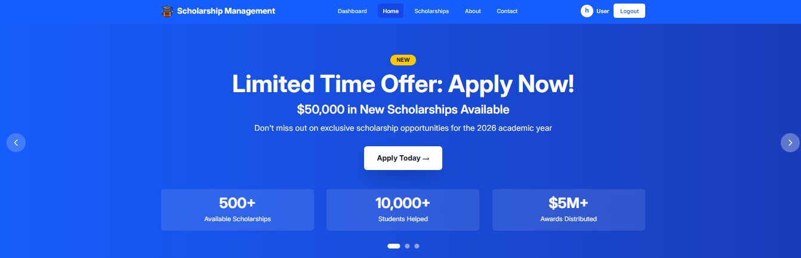
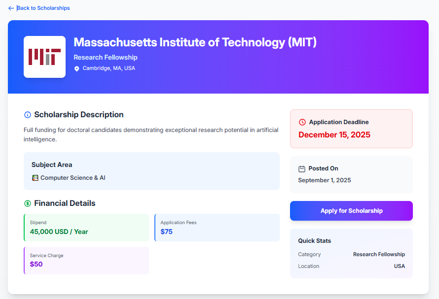

 

## About Me

Computer Science and Engineering student with a focus on web development and building responsive, user-facing applications. Comfortable across the stack — from structuring clean UI in HTML/CSS/Tailwind to handling logic in JavaScript, PHP, and C/C++. Interested in full-stack development, system design fundamentals, and writing maintainable, well-documented code.

**Currently:**
- Building an **e-commerce UI** with a focus on responsive, accessible design
- Strengthening **data structures & algorithms** in C++
- Learning **Tailwind CSS** and modern JavaScript patterns
- Open to **internship / entry-level developer** opportunities and open-source collaboration

 

## Technical Skills

**Languages**

**Frontend**

**Database**

**Tools & Platforms**

 

## Featured Projects

| Project | Description | Tech Stack | Repository |
|---|---|---|---|
| **Scholarship Management System** | A system to manage scholarship applications, eligibility, and approval workflow | [tech stack] | [GitHub](https://github.com/youknowmeright/Assaingment-12-Client) |
| **TutorsPoint** | A platform to search for and hire tutors based on subject, location, and availability | [tech stack] | [GitHub](https://github.com/youknowmeright/Tutors-Point-Client) |

  
  
   
  <b>Scholarship Management System</b> — dashboard (left) and application form (right)

> No live/hosted links yet — each repository above includes full source code, setup instructions, and a detailed README. TutorsPoint doesn't yet have a screenshot; one will be added once the UI is finalized.

 

## GitHub Stats

  
  

  

 

## Contact

I'm currently open to internship and entry-level developer roles. Feel free to reach out.

- **Email:** (mailto:youremail@example.com)
- **LinkedIn:** (https://www.linkedin.com/in/your-linkedin/)
- **Portfolio:** ](https://your-portfolio-site.com)
